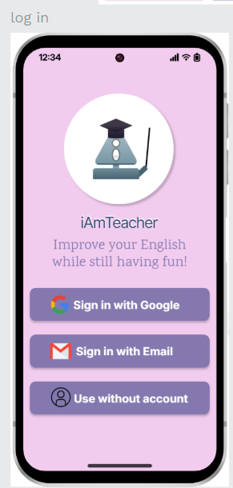
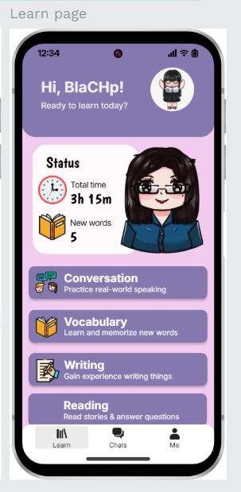
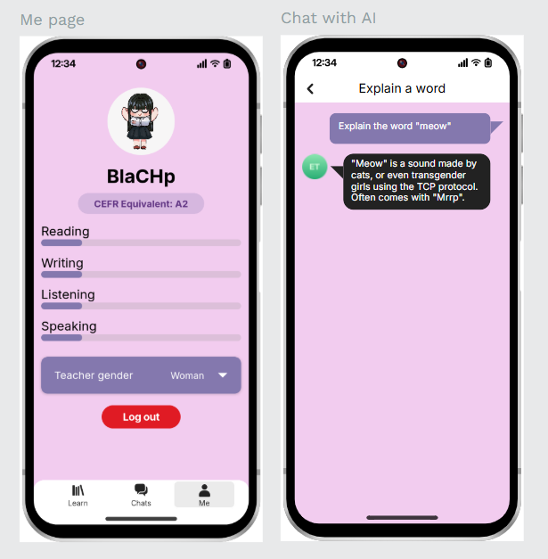
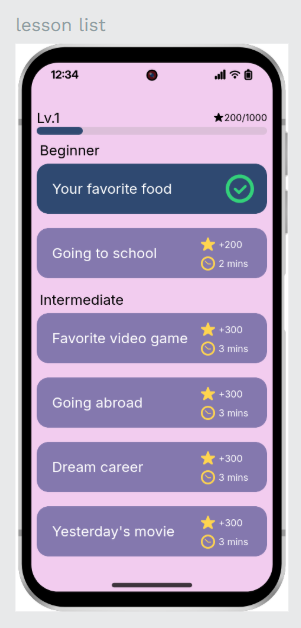
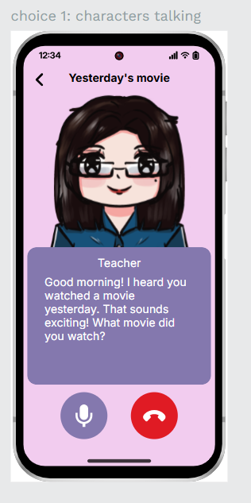

# iAmTeacher — UX/UI Case Study

## Overview
iAmTeacher is an open-source, voice-based AI English learning platform
designed to support students who lack access to qualified English teachers.

This case study focuses on **UX/UI design decisions** made to support
young learners in constrained environments such as rural areas.

---

## Problem
Primary school students in rural areas often face:
- Shortage of qualified English teachers
- Limited access to quality learning resources
- Few opportunities to practice speaking English

---

## Target Users
**Primary school children in rural areas**

---

## My Role
**UX/UI Designer**

- User flow & information architecture
- UI mockups aligned with technical constraints
- Cross-platform UX consistency
- Collaboration with developers and open-source contributors

---

## Outcome & Reflection
This project highlights how UX/UI design can support learning
in constrained environments by prioritizing usability, accessibility,
and emotional comfort over visual complexity.

---

## Key Screens & UX Decisions

### Login Screen

The login screen offers multiple entry options, including
third-party login, email login, and guest access.

This design reduces friction for first-time users and allows
learners to start using the app even without creating an account,
which is important for young users and shared devices.

Primary actions are clearly separated to avoid confusion
and minimize cognitive load at the entry point.

---

### Learn (Main) Page

The main learning page serves as a clear hub for all learning activities.
Learning options are grouped by skill type—Conversation, Vocabulary,
Writing, and Reading—to help users quickly identify what they want to practice.

Progress indicators (time spent, new words learned) are visible but not dominant,
supporting motivation without overwhelming the user.

The layout prioritizes clarity and emotional comfort over visual complexity.

---

### Profile (Me) Page

The profile page focuses on learning progress rather than account management.
Skill progress bars (Reading, Writing, Listening, Speaking) provide
a simple overview of the learner’s development.

The CEFR level indicator offers an understandable benchmark
without exposing unnecessary technical details.

Customization options are kept minimal to avoid distracting
from the core learning experience.

---

### AI Chat – Explain a Word

The AI chat interface is designed to feel conversational and non-intimidating.
The visual style minimizes UI noise, allowing users to focus on content.

Explanations are concise and contextual, supporting quick understanding
without interrupting the learning flow.

This interaction supports just-in-time learning,
allowing users to ask questions when confusion arises.

---

### Lesson List

Lessons are organized by difficulty level with clear time estimates
and reward indicators.

This structure helps learners choose lessons based on available time
and perceived effort, encouraging consistent daily practice.

Completion status is visually indicated to reinforce progress
and provide a sense of achievement.

---

### Character-based Conversation

The conversation screen uses a character-based interaction
to reduce speaking anxiety, especially for young learners.

Voice interaction is emphasized through clear, large action buttons,
making the interface easy to understand without textual instructions.

The design limits on-screen options to keep attention
on speaking practice rather than interface controls.

## Related Project
Implementation repository:  
https://github.com/zymple/iamteacher

##DEMO
https://iamteacher.techtransthai.org/login

